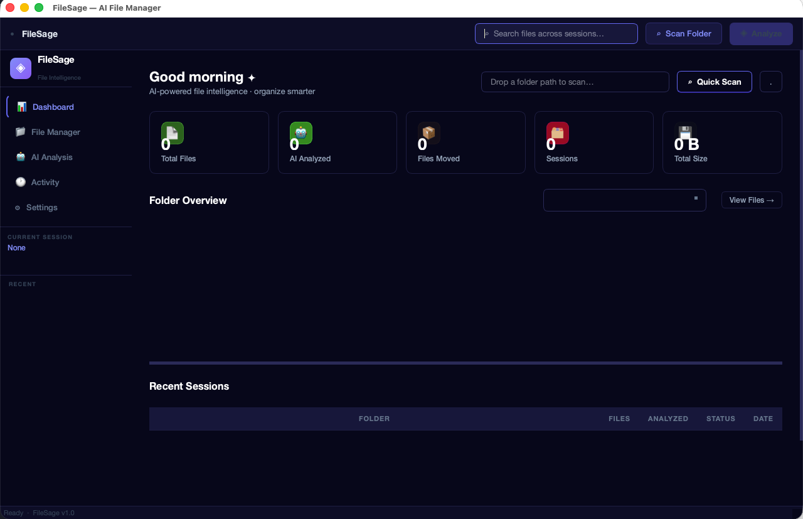

<div align="center">

# ◈ FileSage

### AI-Powered File Intelligence for macOS

**Organize your files intelligently using local Ollama, ChatGPT, or Claude — all running natively on your Mac.**

[](https://python.org)
[](https://riverbankcomputing.com/software/pyqt/)
[](LICENSE)
[](https://apple.com/macos)



</div>

---

## What is FileSage?

FileSage is a native macOS desktop application that uses AI to analyze your files and suggest intelligent folder structures. It reads file names, content previews, and folder context — then recommends where each file should live. You review the suggestions, select what to move, and FileSage does the rest.

**Everything runs locally.** When using Ollama, no file data ever leaves your Mac.

---

## Features

| Feature | Description |
|---|---|
| 📊 **Dashboard** | Overview of all sessions, folder stats, file counts, storage usage |
| 📁 **File Manager** | List & grid view, filter by status, select all, bulk move |
| 🤖 **AI Analysis** | Streaming real-time analysis with live progress log |
| 🕐 **Activity Log** | Full history of every file moved, with Reveal in Finder |
| ⚙️ **Settings** | Default folder, database location, cache management |
| 🦙 **Multi-Provider** | Ollama (local), ChatGPT (OpenAI), Claude (Anthropic) |
| 💾 **Persistent Cache** | Sessions remembered across launches via SQLite |
| 👁 **Preview Mode** | See exactly what will move before committing |
| ↺ **Safe by Default** | Files only move when you explicitly confirm |

---

## Requirements

| Requirement | Details |
|---|---|
| macOS | 12 Monterey or later |
| Python | 3.9+ (3.11+ recommended) |
| AI Provider | One of: Ollama (local), OpenAI API key, or Anthropic API key |

---

## Quick Start

### 1. Clone the repo

```bash
git clone https://github.com/YOUR_USERNAME/filesage.git
cd filesage
```

### 2. Install Ollama (recommended — fully local, free)

```bash
# Install Ollama from https://ollama.ai
brew install ollama       # or download from ollama.ai

# Pull a model (pick one):
ollama pull llama3.2      # fast, great at JSON — recommended
ollama pull qwen2.5:7b    # excellent structured output
ollama pull mistral       # good balance of speed and quality
ollama pull gemma2        # Google's open model

# Start Ollama (if not already running):
ollama serve
```

### 3. Run FileSage

```bash
chmod +x run.sh
./run.sh
```

That's it. The script auto-creates a virtual environment and installs all dependencies.

---

## AI Provider Setup

### 🦙 Ollama (Local — Recommended)

No API key needed. Runs entirely on your Mac.

1. Install Ollama: [ollama.ai](https://ollama.ai)
2. Pull a model: `ollama pull llama3.2`
3. In FileSage → AI Analysis → select **Ollama** → click **Connect**

**Best models for file organization:**

| Model | Size | Speed | Quality |
|---|---|---|---|
| `llama3.2` | 2GB | ⚡ Fast | ★★★★ |
| `qwen2.5:7b` | 4.7GB | ⚡ Fast | ★★★★★ |
| `mistral` | 4.1GB | ⚡ Fast | ★★★★ |
| `llama3.1:8b` | 4.7GB | Medium | ★★★★★ |
| `gemma2:9b` | 5.5GB | Medium | ★★★★ |

---

### ✦ ChatGPT (OpenAI)

1. Get an API key at [platform.openai.com](https://platform.openai.com)
2. In FileSage → AI Analysis → select **ChatGPT**
3. Paste your `sk-proj-...` key → click **Test Connection**

**Supported models:** `gpt-4o`, `gpt-4o-mini`, `gpt-4-turbo`, `gpt-3.5-turbo`

> **Cost estimate:** ~$0.01–0.05 per 100 files with `gpt-4o-mini`

---

### ◈ Claude (Anthropic)

1. Get an API key at [console.anthropic.com](https://console.anthropic.com)
2. In FileSage → AI Analysis → select **Claude**
3. Paste your `sk-ant-...` key → click **Test Connection**

**Supported models:** `claude-opus-4-5`, `claude-sonnet-4-5`, `claude-haiku-4-5`

---

## How to Use

### Step-by-step workflow

```
1. Launch FileSage
       ↓
2. Dashboard → type or browse to a folder → "Quick Scan"
       ↓
3. FileSage indexes all files (reads names, folder, content preview)
       ↓
4. AI Analysis → choose provider + model → "Run AI Analysis"
       ↓
5. Watch the live streaming log as AI processes files in batches
       ↓
6. File Manager → review suggestions (green → arrows show new paths)
       ↓
7. Select files → "Preview Move" to see what will happen
       ↓
8. "Move Selected" → confirm → done ✓
       ↓
9. Activity Log → see full history, reveal any file in Finder
```

### Tips

- **Analyze selected files only** — select specific files in File Manager before clicking Analyze to focus AI on those
- **Always Preview first** — use "Preview Move" to see a dry run with no files touched
- **Large folders** — files are processed in batches of 20; the progress log shows each batch
- **Sessions persist** — close and reopen FileSage, your analysis is still there
- **Multiple sessions** — scan different folders independently, switch between them from the sidebar

---

## Build a Standalone .app

To create a proper macOS `.app` bundle (no Python required to run):

```bash
chmod +x build_mac.sh
./build_mac.sh

# Then install:
cp -r dist/FileSage.app /Applications/
open /Applications/FileSage.app
```

---

## Project Structure

```
filesage/
├── main.py          # Full PyQt6 UI — 5 pages, sidebar, all widgets
├── core.py          # SQLite database, file scanner, move logic
├── workers.py       # Background QThread workers (scan + AI analysis)
├── requirements.txt # PyQt6, requests
├── run.sh           # One-command launcher with venv setup
├── build_mac.sh     # Builds FileSage.app via PyInstaller
└── README.md        # This file
```

### Architecture

```
FileSage (PyQt6)
├── MainWindow
│   ├── Sidebar         — navigation + session list + current session stats
│   ├── DashboardPage   — stat cards + folder overview + sessions table
│   ├── FileManagerPage — file list/grid + filters + move actions
│   ├── AIAnalysisPage  — provider selector + config + streaming log
│   ├── ActivityPage    — move history table + Reveal in Finder
│   └── SettingsPage    — storage, default paths, cache management
│
├── ScanWorker (QThread)
│   └── Walks directory tree, reads file previews, writes to SQLite
│
└── AnalyzeWorker (QThread)
    ├── Ollama   — streams via /api/generate (local, private)
    ├── OpenAI   — streams via /v1/chat/completions (SSE)
    └── Anthropic — streams via /v1/messages (SSE)

Data: ~/.filesage/filesage.db  (SQLite — persists across launches)
```

---

## Data & Privacy

- **Ollama:** All data stays on your Mac. Zero network requests for AI.
- **ChatGPT / Claude:** File names, folder names, and up to 200 characters of text content are sent to the API per file. Full file contents are **never** sent.
- **Cache:** Stored at `~/.filesage/filesage.db`. Clear anytime from Settings.
- **Files:** Never modified until you explicitly click "Move Selected" and confirm.

---

## Troubleshooting

### App won't start

```bash
# Check Python version (need 3.9+)
python3 --version

# Install a newer Python via Homebrew
brew install python@3.11

# Delete venv and retry
rm -rf .venv
./run.sh
```

### Ollama won't connect

```bash
# Make sure Ollama is running
ollama serve

# Check it's reachable
curl http://localhost:11434/api/tags

# Check you have models installed
ollama list
```

### "No module named PyQt6"

```bash
# Force reinstall dependencies
rm -rf .venv
./run.sh
```

### Font warnings in console (`Populating font family aliases`)

Harmless — Qt on macOS takes a moment to build its font index on first launch. Subsequent launches are instant. The warning is suppressed automatically in `run.sh`.

### urllib3 SSL warning

Harmless — Python 3.9 on older macOS ships with LibreSSL instead of OpenSSL. Fully suppressed in `run.sh` via `-W ignore`.

### Build fails (`build_mac.sh`)

```bash
# Install Xcode command line tools
xcode-select --install

# Then retry
./build_mac.sh
```

---

## Contributing

Pull requests welcome. Please open an issue first for major changes.

```bash
git clone https://github.com/YOUR_USERNAME/filesage.git
cd filesage
chmod +x run.sh
./run.sh    # runs from source directly
```

---

## License

MIT License — see [LICENSE](LICENSE) for details.

---

<div align="center">

Built with ❤️ using [PyQt6](https://riverbankcomputing.com/software/pyqt/) · [Ollama](https://ollama.ai) · [OpenAI](https://openai.com) · [Anthropic](https://anthropic.com)

</div>
